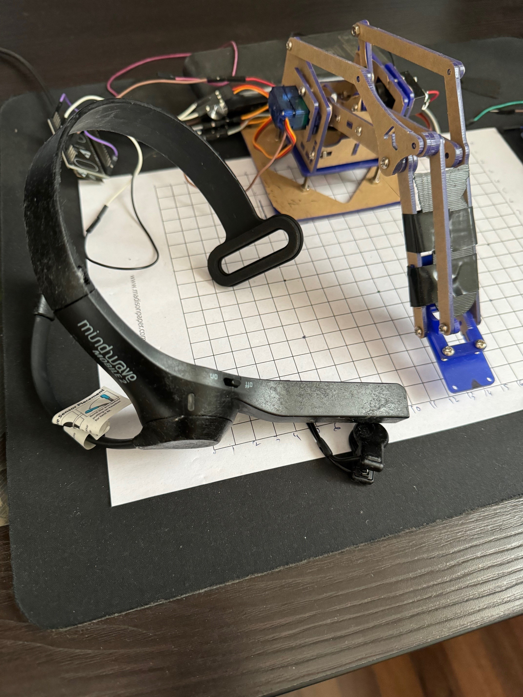

##Control Robot Arm with mind,  ESP32 and NeuroSky using Python

This repository contains Python code to control a robot arm using an ESP32 microcontroller and NeuroSky EEG headset. The project involves two components:

ESP32 Code: This part of the project involves programming an ESP32 microcontroller to receive commands from a Python script and control the servo motors of a robot arm accordingly.

NeuroSky Interface: This part of the project involves interfacing with a NeuroSky EEG headset to measure brainwave data, process it, and send commands to the ESP32 microcontroller based on the received data.

ESP32 Code
The ESP32 code is written in Arduino-compatible C/C++ and is located in the esp32_code directory. It includes the necessary code to set up a web server, handle WebSocket connections, and control servo motors based on received commands.

The key files in this directory include:

esp32_code.ino: This is the main Arduino sketch file containing the setup and loop functions, as well as WebSocket event handling and servo control logic.
index.h: This file contains the HTML and JavaScript code to serve a web page that establishes a WebSocket connection with the ESP32 server.
Python NeuroSky Interface
The Python code for interfacing with the NeuroSky EEG headset and sending commands to the ESP32 microcontroller is located in the root directory of the repository. It includes functionalities to establish a TCP connection with the NeuroSky device, parse JSON data received from it, and send commands to the ESP32 via WebSocket.

The key files in this directory include:

neurosky_control.py: This is the main Python script responsible for interfacing with the NeuroSky EEG headset, parsing brainwave data, and sending commands to the ESP32 microcontroller.
Requirements
To run this project, you will need:

An ESP32 microcontroller with the necessary components (e.g., servo motors) connected.
A NeuroSky EEG headset compatible with the MindWave Mobile protocol.
Python 3.x installed on your computer with the required libraries 
Getting Started
Clone this repository to your local machine:

Copy code
git clone https://github.com/your-username/robot-arm-control.git
Upload the esp32_code directory to your ESP32 microcontroller using the Arduino IDE or similar software.

Install the required Python libraries:

Connect the NeuroSky EEG headset to your computer via Bluetooth .

Run the Python script neurosky_control.py:

Copy code
python neurosky_control.py
License
